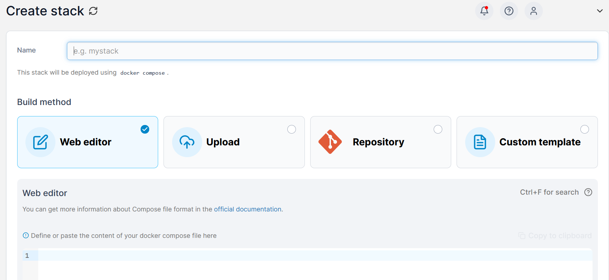

This part explains how install docker and associated services for your homeserver. All theses steps are optional, so if you dont want to install any of these and just use the shared network folder, skip this.

# Step 1: Install docker
Docker is the software that will host other applications on the NAS. Why not installing them bare-metal? Because of dependencies. One slight change, e.g. via update or misconfiguration, might bring the entire homeserver down. So instead, we will be using docker containsers, which encapsulates certain aspects of a software environment into a nice, individual packages.   
Docker will allow us to install services for e.g.
- sync photos from the smartphone to the server to a web-ui and back
- syncronize notes
- access passwordmanager
- ...
All of these are of course optional, or can be replaced by alternatives.

## Main docker installation
Lets start by installing docker, the basic service which all other additional services depend on.
```
doas apk add docker docker-compose
```
Next, lets make docker able to run without root privilliges. Add your current user to the docker group, which was automatically setup during the previous step.
```
doas adduser §{User} docker
```
Lets add docker to the services that will be started at boot.
```
doas rc-update add docker boot
```
reboot.
## Optional installation of portainer
Managing docker via command line is a bit tedious, so lets install a WebUI for managing docker. So if you want, here are your two last ever docker commands. The first one creates a storage volumne for the portainer configuration files. The second one download, installs, and runs, portainer.
```
docker volume create portainer_data
```
If you have permission errors, search help for correct docker rootless usage before running the next docker related steps.  
Next, download and run portainer as a docker container with this command:
```
docker run -d -p 8000:8000 -p 9443:9443 --name portainer --restart=always -v /var/run/docker.sock:/var/run/docker.sock -v portainer_data:/data portainer/portainer-ce:2.21.3
```
On a second device within your local network (or later via tailscale network), type the ip of the server, and add the port of portainer.
```
https://192.168.178.XXX:9443/
```
Upon your first visit to the site you will be asked to set your portainer administrator username and password. Next, click on the "new environment" option, and then click on the only option presented to you.
> 

# Install nginx proxy manager
## Basic installation of NPM
We will install a couple of services, requiering to know a lot of IPs and ports by heart. For convinience, i will install a tool that routs data based on the url, e.g. `portanier.mydomain.com` will provide the webpage to portainer instead of `192.168.178.2:9443`, and later `photos.mydomain.com` will open the photo sync service website instead of `192.168.178.2:11003`. NGINX Proxy Manager (NPM) is the tool i chose for this, but there is also Traefik and many others. An additional benefit is using HTTPS for basically every service, even if we only access our services locally.  

Lets install it in the portainer web user interface. Login to your local portainer web instance, and add a "stack". 
>
>

Enter a descriptive name to the "name" top field, and copy paste the following text into the big field.
```
version: '3.8'
services:
  app:
    image: 'jc21/nginx-proxy-manager:latest'
    restart: unless-stopped
    ports:
      - '80:80'
      - '81:81'
      - '443:443'
    volumes:
      - ./data:/data
      - ./letsencrypt:/etc/letsencrypt
```
Make sure to name it, otherwise portainer will not let you create the service. On the bottom of the page, click "deploy stack", and wait a bit. 
> 

Once automatically redirected to the `stacks` overview page, you can now access nginx-proxy-manager via the webui on your servers ip:
```
http://192.168.178.XXX:81/login
```
## Change default login
The credential for the first login are 
```
admin@example.com
changeme
```
Upon first login, you will be asked to change the username and password. The presented user interface should look like this (+- the numbers, they show my current setup, yours should say "0")
> 

## NGINX configuration
A complete guide on how to NGINX to access all your services securely with HTTPS, and your domain, can be found [here](https://www.youtube.com/watch?v=qlcVx-k-02E&t=456s).
## Excursion: Domain configuration Add a domain and service to NPM
The tutorial linked above uses [duckdns](https://www.duckdns.org/), which worked very reliably in my tests. However, i prefere a custom domain, so i bought one via [netcup](https://www.netcup.com/en). In the following text i will refere only to my own setup. 

My current setup looks like this in my registrar'S options:
| Target        | Type           | Value  |
| ------------- |:-------------:| -----:|
| @     | A | 192.168.178.XXX |
| *      | A      |   192.168.178.XXX |

`@` references the main domain, `mydomain.com`.`*` references all possible subdomains, e.g. `wildtiger.mydomain.com`. If your registrat does not support this, then use CNAME and point it to `mydomain.com` instead of the IP. If you want to use IPv6, use `AAAA`. I chose my local ipv4, so that i can access all my services from at home. I do not plan to open any services to the internet, they will only be accessibe locally or via VPN. Also, if possible, enable `DNSSEC` in your registrar's options. 
  
We will need an API access to get the SSL certificate. So while you are logged in, check the options to see if and how you can generate one. Make sure to write down each detail, because chances are, they will only be displayed once...

> [!Note]
> Some browsers think it's strange and unsafe if you try to access a website, and the addressed server is within your local network. Check if your router has a "loopback" or "pinhole" setting. I needed to add my domain and subdomains to the exception list in my Fritz!Box router.

## Getting a SSL certificate
Open your NGINX interface and navigate to the `SSL Certificates` option. Next, `Add SSL Certificate`, and the option `Let's encrypt`. Enter one by one the following text
```
mydomain.com
*.mydomain.com
```
Click each time the popup once you finished typing, and make sure that the text appears with a grey background. The final result should look like this:
> 

Click "save" and wait until your certificate appers in the list.  
In my case, i needed a time setting of 600 seconds in order to get the certificate. NGINX will present some "timeout" or "warning" messages before the end of 10 minutes/600 seconds. However, if you dont touch anything after clicking "save", and ignore the "failed state", and then refresh the page, there will be your SSL certificate in the list.

## Adding a service to NPM
Host > Proxy Host > "Add Proxy host". Use the settings from the screenshots below.
- cache assets
- Block common exploits
- Websocket support
- Use your new ssl certificate
- Force SSL
- HTTP/2 support
- HSTS enable
> 
> 

Not all services strictly need these options; most simple ones will run fine without any. However, if in doubt, for the first run, use my examples.
